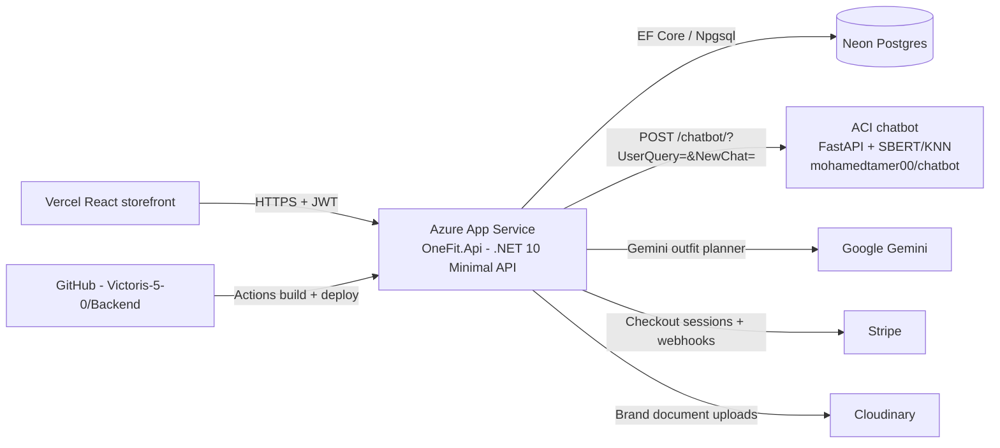

## Don't forget The winner takes it all

## Architecture

OneFit is an AI fashion marketplace: a .NET 10 Minimal API backend on Azure App Service,
a Postgres (Neon) database, a FastAPI AI chatbot on Azure Container Instances, and a
React storefront on Vercel.

### Solution layout (Clean Architecture)

| Project | Role |
|---|---|
| `src/OneFit.Api` | Minimal API endpoints (`Endpoints/`), DI wiring, Scalar/OpenAPI docs |
| `OneFit.Application` | MediatR commands/queries, orchestrators (`Stylist`, `Chatbot`), validators, DTOs |
| `OneFit.Domain` | Entities (`Product`, `Brand`, `Cart`, `Order`, `Shopper`, …) |
| `OneFit.Infrastructure` | EF Core `DbContext`, repositories, `ProductQueryService`, Identity/JWT, Stripe, Cloudinary, Gemini planner, seeding |
| `OneFit.Stylist.Tests` | xUnit suite (orchestrator, Gemini planner) |

### Request flow

- `POST /stylist/message` → `StylistOrchestrator` keeps a per-shopper session (intent merged
  across turns; `new_chat: true` resets it), asks for missing budget, calls the Gemini planner,
  then assembles outfits from the catalog — rotating already-shown items so repeats vary.
- `POST /chatbot/message` → `ChatbotOrchestrator` forwards the query to the ACI chatbot,
  dedupes the returned product IDs, and enriches each one from our catalog
  (`products[]`; IDs with no DB match land in `missing_ids`).
- Shop paths (`/products`, cart, wishlist, checkout, orders, feed) are MediatR handlers over EF Core.

### Conventions

- All JSON is `snake_case`. Errors use `{ "error": { "code": "…", "message": "…" } }`.
- Every list endpoint guarantees duplicate-free items; AI endpoints rotate instead of repeating.
- Auth is JWT Bearer; the token carries a `UserId` claim used by cart/checkout/orders.

### Deployment

- Production API: `https://onefit-gqcneva3b3bsfnb9.francecentral-01.azurewebsites.net` (App Service `OneFit`, `IEEE-hackathon` RG).
- Production chatbot: `http://onefit-chatbot.francecentral.azurecontainer.io:8000` (Container Instance `onefit-chatbot`).
- CI/CD: `.github/workflows/main_onefit.yml` builds with .NET 10 and deploys on every `main` push.
- Required Azure app settings: `ConnectionStrings__DefaultConnection`, `Cors__AllowedOrigins__0`,
  `Frontend__BaseUrl`, `Chatbot__BaseUrl`, `Jwt__SecretKey`, `Stripe__*`, `CloudinarySettings__*`
  (secrets live in app settings only — never commit them).